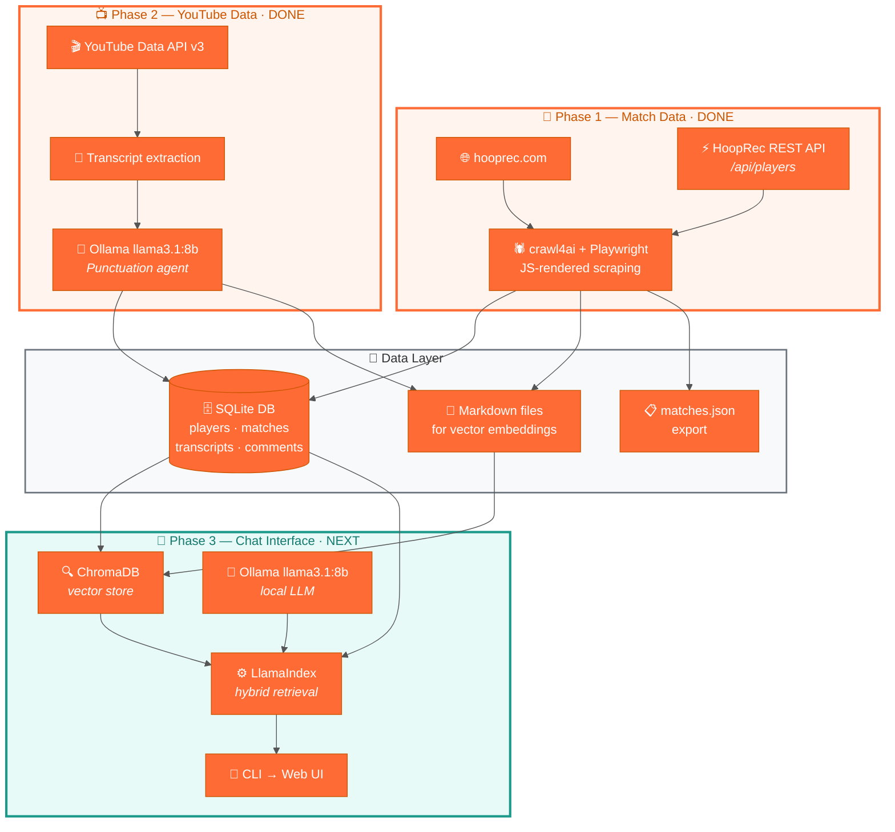

# 1v1 Basketball RAG Scraper

A knowledge base and conversational AI project built on top of [hooprec.com](https://hooprec.com) — a 1v1 basketball stats site that tracks head-to-head matchups, player records, scores, and game film.

The goal: **ask natural-language questions about 1v1 basketball** and get answers grounded in real data.

> *"What's the most popular 1v1 involving Left Hand Dom?"*
> *"Show me a game with a controversial incident."*
> *"Who has Qel beat that Skoob has lost to — and where can I watch those games?"*

## Architecture



---

## Data Sources

| Source | What we collect | How |
|---|---|---|
| [hooprec.com](https://hooprec.com) match pages | Players, scores, winners, dates, game-film YouTube links | crawl4ai (Playwright) parses JS-rendered `onclick` handlers |
| [hooprec.com REST API](https://hooprec.com/players_directory.html) | Full player directory (204 active players with ratings, records, locations) | Direct HTTP `GET /api/players?limit=500` |
| YouTube | Video metadata, transcripts, descriptions, top comments | YouTube Data API v3 + `youtube-transcript-api` + Ollama punctuation agent |

---

## Phase 1 — Match Data Ingestion ✅

**Status: Complete.** The scraper runs daily via Windows Task Scheduler.

The ingestion script (`hooprec_master_ingest.py`) does three things on each run:

1. **Players** — Calls the HoopRec REST API to fetch all 204 active players (name, ID, profile URL, win/loss record, rating).
2. **Match links** — Scrapes `matches_directory.html` with Playwright, parsing `onclick="window.location.href='match_detail.html?match=...'"` handlers to discover all match slugs.
3. **Match details** — For each unscraped match, fetches the detail page and extracts player names (from `viewPlayer('Name')` onclick), scores (from `<div class="match-score">`), dates (from `<div class="info-value">`), and YouTube URLs.

Everything is resumeable — if the script crashes mid-run, re-running it skips already-completed matches.

### Current database

| Table | Rows | Notes |
|---|---|---|
| `players` | 359 | 204 from API + 155 discovered through matches |
| `matches` | 627 | 598 with YouTube links, all with dates |
| `player_matches` | 1,254 | Win/loss/score per player per match |
| `youtube_videos` | 572 | Video metadata (title, views, likes, duration, channel) |
| `youtube_transcripts` | 572 | Raw + Ollama-cleaned transcripts with timestamped segments |
| `youtube_comments` | 11,038 | Top comments per video (up to 20 each, sorted by relevance) |

### Project structure

```
hooprec-scraper/
├── data/                          # Persistent project data (gitignored)
│   ├── db/
│   │   └── hooprec.sqlite         # Shared SQLite database
│   └── raw/
│       ├── hooprec_md/            # Phase 1 Markdown (match pages, players)
│       ├── youtube_md/            # Phase 2 Markdown (transcripts, comments)
│       └── matches.json           # Matches JSON export
├── hooprec-ingest/                # Phase 1 — HoopRec scraper
│   ├── hooprec_master_ingest.py   # Main ingestion script
│   ├── schema.sql                 # SQLite DDL
│   ├── requirements.txt           # Python dependencies
│   ├── run_ingest.ps1             # Task Scheduler wrapper (daily runs)
│   └── schedule_task.ps1          # One-time: registers the scheduled task
├── youtube-ingest/                # Phase 2 — YouTube data collection
│   ├── youtube_ingest.py          # Main YouTube ingestion script
│   └── requirements.txt           # Python dependencies
├── rag/                           # Phase 3 — RAG chat interface (next)
└── README.md
```

### Running it

```bash
cd hooprec-ingest
pip install -r requirements.txt
playwright install chromium
python hooprec_master_ingest.py
```

### Configuration

| Variable | Default | Description |
|---|---|---|
| `HOOPREC_DB` | `data/db/hooprec.sqlite` | Path to the SQLite database |
| `HOOPREC_MD_DIR` | `data/raw/hooprec_md` | Markdown output directory |
| `HOOPREC_JSON` | `data/raw/matches.json` | Matches JSON export path |
| `HOOPREC_DELAY` | `2.5` | Seconds to wait for JS rendering |
| `HOOPREC_CONCUR` | `3` | Max concurrent match-detail fetches |

---

## Phase 2 — YouTube Data Collection ✅

**Status: Complete.** 572 of 598 YouTube-linked matches enriched with video metadata, transcripts, and comments.

The YouTube ingestion script (`youtube_ingest.py`) enriches the database with the content *inside* match videos:

1. **Video metadata** — Fetches title, description, view count, like count, publish date, channel name, and duration via YouTube Data API v3 (batched, up to 50 IDs per call).
2. **Transcripts** — Extracts auto-generated captions via `youtube-transcript-api`. Raw caption text and timestamped segments are stored separately.
3. **Punctuation agent** — A local Ollama instance (llama3.1:8b on RTX 4070 Super) post-processes raw transcripts to add punctuation, capitalization, paragraph breaks, and speaker identification. Long transcripts are chunked into 2,000-word overlapping segments for processing.
4. **Top comments** — Fetches up to 20 top-level comments per video sorted by relevance.
5. **Markdown output** — Generates one file per video in `data/raw/youtube_md/` containing match metadata, video stats, cleaned transcript, and top comments — ready for Phase 3 vector embedding.

Everything is resumable — checkpoints each video in `scrape_progress`. Raw and cleaned transcripts are stored separately so the punctuation agent can be re-run with a better model/prompt without re-fetching from YouTube.

### Why this matters

Match stats alone (scores, winner/loser) can't answer questions about *what happened in the game*. The transcript and comments layer is what enables queries like:

- *"Show me a game where someone hit a game-winner at the buzzer."*
- *"What's a controversial call in a Left Hand Dom game?"*
- *"Which games do fans consider the best of all time?"*

### Running it

```bash
cd youtube-ingest
pip install -r requirements.txt
python youtube_ingest.py                    # process all matches
python youtube_ingest.py --limit 50         # first 50 only
python youtube_ingest.py --video-id ABC123  # single video
python youtube_ingest.py --skip-ollama      # skip punctuation pass
python youtube_ingest.py --refresh          # re-fetch metadata + comments only
python youtube_ingest.py --dry-run          # preview, no writes
```

### Configuration

| Variable | Default | Description |
|---|---|---|
| `YOUTUBE_API_KEY` | *(required)* | YouTube Data API v3 key (stored in `.env`) |
| `HOOPREC_DB` | `data/db/hooprec.sqlite` | Path to the SQLite database |
| `YOUTUBE_MD_DIR` | `data/raw/youtube_md` | Markdown output directory |
| `OLLAMA_MODEL` | `llama3.1:8b` | Ollama model for transcript cleaning |
| `OLLAMA_TIMEOUT` | `120` | Seconds before Ollama timeout |

---

## Phase 3 — RAG Chat Interface 🔜

With match data *and* YouTube content in the database, Phase 3 wires it all into a conversational interface. Fully local — no cloud APIs required.

### Stack

| Component | Choice | Why |
|---|---|---|
| **RAG framework** | LlamaIndex | Purpose-built for RAG, first-class hybrid retrieval, good learning investment |
| **Vector store** | ChromaDB | Persistent, metadata filtering, zero infrastructure |
| **LLM** | Ollama (llama3.1:8b) | Already running from Phase 2, free, private |
| **Embeddings** | nomic-embed-text via Ollama | Local, no API key needed |
| **Chat UI** | CLI first, web later | Fast iteration, add Streamlit/Gradio once the engine works |

### How it works

1. **Ingest** — YouTube Markdown files (transcripts + comments + metadata) are chunked and embedded into ChromaDB via LlamaIndex with nomic-embed-text.
2. **Retrieve** — User questions are routed by a `RouterQueryEngine`:
   - **Vector path** — Semantic search over transcripts and comments for narrative/opinion questions.
   - **SQL path** — `NLSQLTableQueryEngine` over `hooprec.sqlite` + `query_common_opponents()` wrapped as a `FunctionTool` for stats and comparison queries.
3. **Generate** — Retrieved context is passed to Ollama which synthesizes a grounded answer with citations and YouTube links.

### Example queries the system should handle

| Question | Data needed | Retrieval path |
|---|---|---|
| *"What's the most popular 1v1 involving Left Hand Dom?"* | `youtube_videos.view_count` + `matches` join | SQL |
| *"Show me a game with a controversial incident"* | Transcript text search + comment sentiment | Vector |
| *"Who has Qel beat that Skoob has lost to?"* | `query_common_opponents()` SQL helper (already built) | SQL (FunctionTool) |
| *"What do fans think of Nasir Core?"* | Comment text across all his match videos | Vector |
| *"Summarize Left Hand Dom vs Chris Lykes"* | Match stats + transcript + top comments | Hybrid (both) |

### The script already includes a RAG query helper

```python
from hooprec_master_ingest import query_common_opponents
import sqlite3

conn = sqlite3.connect("data/db/hooprec.sqlite")
results = query_common_opponents(conn, "Qel", "Skoob")
for r in results:
    print(f"{r['opponent']}  Qel YT: {r['player_a_youtube']}  Skoob YT: {r['player_b_youtube']}")
```

### Planned structure

```
rag/
├── __init__.py
├── ingest.py          # Document loading, chunking, embedding → ChromaDB
├── query_engine.py    # Vector + SQL engines, hybrid router
├── cli.py             # Interactive CLI REPL
├── config.py          # Paths, model names, chunk sizes (env-configurable)
└── requirements.txt   # LlamaIndex + ChromaDB deps
```

---

## License

Private — not for redistribution.
