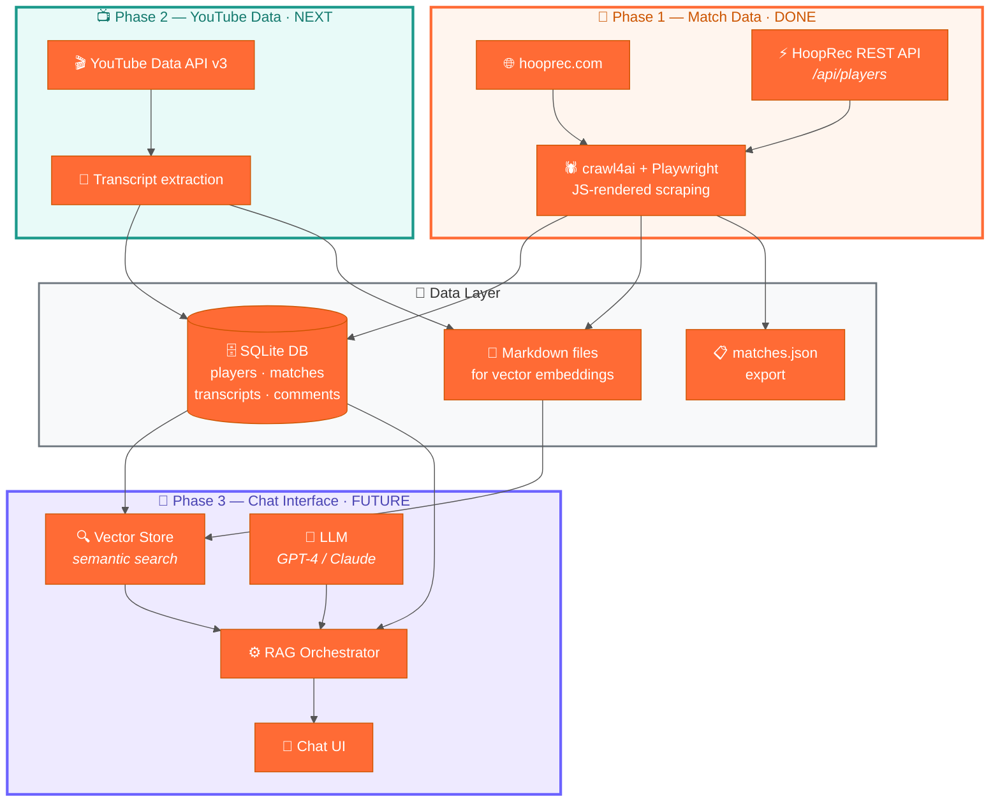

# 1v1 Basketball RAG Scraper

A knowledge base and conversational AI project built on top of [hooprec.com](https://hooprec.com) — a 1v1 basketball stats site that tracks head-to-head matchups, player records, scores, and game film.

The goal: **ask natural-language questions about 1v1 basketball** and get answers grounded in real data.

> *"What's the most popular 1v1 involving Left Hand Dom?"*
> *"Show me a game with a controversial incident."*
> *"Who has Qel beat that Skoob has lost to — and where can I watch those games?"*

## Architecture



---

## Data Sources

| Source | What we collect | How |
|---|---|---|
| [hooprec.com](https://hooprec.com) match pages | Players, scores, winners, dates, game-film YouTube links | crawl4ai (Playwright) parses JS-rendered `onclick` handlers |
| [hooprec.com REST API](https://hooprec.com/players_directory.html) | Full player directory (204 active players with ratings, records, locations) | Direct HTTP `GET /api/players?limit=500` |
| YouTube *(Phase 2)* | Video metadata, transcripts, descriptions, top comments | YouTube Data API v3 + transcript extraction |

---

## Phase 1 — Match Data Ingestion ✅

**Status: Complete.** The scraper runs daily via Windows Task Scheduler.

The ingestion script (`hooprec_master_ingest.py`) does three things on each run:

1. **Players** — Calls the HoopRec REST API to fetch all 204 active players (name, ID, profile URL, win/loss record, rating).
2. **Match links** — Scrapes `matches_directory.html` with Playwright, parsing `onclick="window.location.href='match_detail.html?match=...'"` handlers to discover all match slugs.
3. **Match details** — For each unscraped match, fetches the detail page and extracts player names (from `viewPlayer('Name')` onclick), scores (from `<div class="match-score">`), dates (from `<div class="info-value">`), and YouTube URLs.

Everything is resumeable — if the script crashes mid-run, re-running it skips already-completed matches.

### Current database

| Table | Rows | Notes |
|---|---|---|
| `players` | 359 | 204 from API + 155 discovered through matches |
| `matches` | 627 | 598 with YouTube links, all with dates |
| `player_matches` | 1,254 | Win/loss/score per player per match |

### Project structure

```
hooprec-ingest/
├── hooprec_master_ingest.py   # Main ingestion script
├── schema.sql                 # SQLite DDL (players, matches, player_matches, scrape_progress)
├── requirements.txt           # Python dependencies
├── run_ingest.ps1             # Task Scheduler wrapper (daily runs)
├── schedule_task.ps1          # One-time: registers the scheduled task
└── data/
    └── hooprec_md/            # Markdown dump of every scraped page (for vector indexing)
```

### Running it

```bash
cd hooprec-ingest
pip install -r requirements.txt
playwright install chromium
python hooprec_master_ingest.py
```

### Configuration

| Variable | Default | Description |
|---|---|---|
| `HOOPREC_DB` | `players.db` | Path to the SQLite database |
| `HOOPREC_MD_DIR` | `data/hooprec_md` | Markdown output directory |
| `HOOPREC_JSON` | `matches.json` | Matches JSON export path |
| `HOOPREC_DELAY` | `2.5` | Seconds to wait for JS rendering |
| `HOOPREC_CONCUR` | `3` | Max concurrent match-detail fetches |

---

## Phase 2 — YouTube Data Collection 🔜

Every match on HoopRec links to a YouTube video (598 of 627 matches have a URL). Phase 2 enriches the database with the content *inside* those videos:

- **Video metadata** — Title, description, view count, like count, publish date, channel name, duration.
- **Transcripts** — Auto-generated or manual captions extracted via `youtube-transcript-api`. These capture commentary, player callouts, and play-by-play narration.
- **Top comments** — The most-liked comments often surface crowd favorites, controversial moments, and memorable plays.

### Why this matters

Match stats alone (scores, winner/loser) can't answer questions about *what happened in the game*. The transcript and comments layer is what enables queries like:

- *"Show me a game where someone hit a game-winner at the buzzer."*
- *"What's a controversial call in a Left Hand Dom game?"*
- *"Which games do fans consider the best of all time?"*

### Planned schema additions

```sql
CREATE TABLE youtube_videos (
    id             INTEGER PRIMARY KEY AUTOINCREMENT,
    match_id       INTEGER REFERENCES matches(id),
    video_id       TEXT NOT NULL UNIQUE,
    title          TEXT,
    description    TEXT,
    channel_name   TEXT,
    view_count     INTEGER,
    like_count     INTEGER,
    comment_count  INTEGER,
    duration_sec   INTEGER,
    published_at   TEXT,
    scraped_at     TEXT
);

CREATE TABLE youtube_transcripts (
    id          INTEGER PRIMARY KEY AUTOINCREMENT,
    video_id    TEXT NOT NULL REFERENCES youtube_videos(video_id),
    language    TEXT DEFAULT 'en',
    text        TEXT,       -- full transcript as one block
    segments    TEXT,       -- JSON array of {start, duration, text}
    scraped_at  TEXT
);

CREATE TABLE youtube_comments (
    id              INTEGER PRIMARY KEY AUTOINCREMENT,
    video_id        TEXT NOT NULL REFERENCES youtube_videos(video_id),
    comment_id      TEXT NOT NULL UNIQUE,
    author          TEXT,
    text            TEXT,
    like_count      INTEGER,
    published_at    TEXT,
    is_top_level    INTEGER DEFAULT 1
);
```

### Approach

1. Walk every match row that has a `youtube_url`.
2. Call the YouTube Data API v3 for video metadata + top comments.
3. Call `youtube-transcript-api` for captions.
4. Save transcript text as Markdown (one file per video) for vector indexing alongside the existing match Markdown.
5. Checkpoint each video in `scrape_progress` for resumeability, same pattern as Phase 1.

---

## Phase 3 — RAG Chat Interface 🔮

With match data *and* YouTube content in the database, Phase 3 wires it all into a conversational interface:

### How it works

1. **Embed** — Markdown files (match pages + transcripts + comments) are chunked and embedded into a vector store.
2. **Retrieve** — User questions are embedded and matched against the vector store to find relevant chunks. Structured SQL queries (like `query_common_opponents()`) run in parallel for precise lookups.
3. **Generate** — Retrieved context is passed to an LLM (GPT-4 / Claude) which synthesizes a grounded answer with citations and YouTube links.

### Example queries the system should handle

| Question | Data needed |
|---|---|
| *"What's the most popular 1v1 involving Left Hand Dom?"* | `youtube_videos.view_count` + `matches` join |
| *"Show me a game with a controversial incident"* | Transcript text search + comment sentiment |
| *"Who has Qel beat that Skoob has lost to?"* | `query_common_opponents()` SQL helper (already built) |
| *"What do fans think of Nasir Core?"* | Comment text across all his match videos |
| *"Summarize Left Hand Dom vs Chris Lykes"* | Match stats + transcript + top comments |

### The script already includes a RAG query helper

```python
from hooprec_master_ingest import query_common_opponents
import sqlite3

conn = sqlite3.connect("players.db")
results = query_common_opponents(conn, "Qel", "Skoob")
for r in results:
    print(f"{r['opponent']}  Qel YT: {r['player_a_youtube']}  Skoob YT: {r['player_b_youtube']}")
```

### Planned components

- **Vector store** — FAISS or Chroma over chunked Markdown (match pages, transcripts, comment threads).
- **Orchestrator** — Routes questions to vector search, SQL lookups, or both, then merges context for the LLM.
- **LLM** — GPT-4 or Claude for answer generation with tool/function calling support.
- **Chat UI** — Lightweight web interface or CLI for interactive Q&A.

---

## License

Private — not for redistribution.
