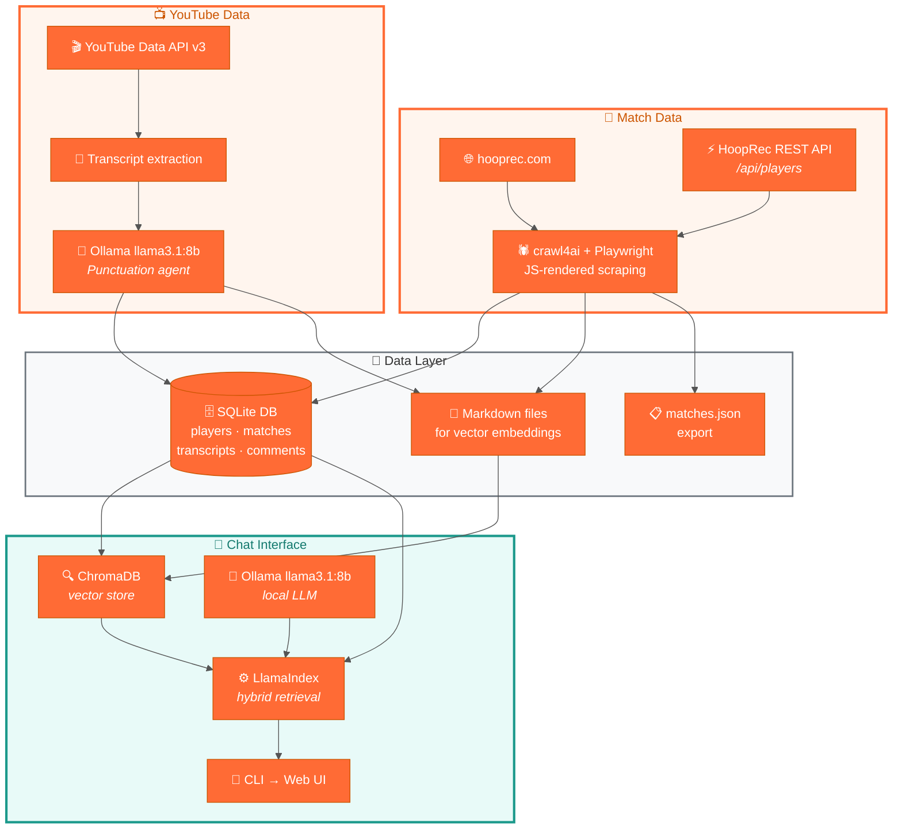

# Architecture

> Back to [README](../README.md) · See also: [HoopRec Scraper](hooprec-scraper.md) · [YouTube Ingest](youtube-ingest.md) · [RAG Engine](rag-engine.md) · [Web UI](web-ui.md)

## Overview



## Data Sources

| Source | What we collect | How |
|---|---|---|
| [hooprec.com](https://hooprec.com) match pages | Players, scores, winners, dates, game-film YouTube links | crawl4ai (Playwright) parses JS-rendered `onclick` handlers |
| [hooprec.com REST API](https://hooprec.com/players_directory.html) | Full player directory (204 active players with ratings, records, locations) | Direct HTTP `GET /api/players?limit=500` |
| YouTube | Video metadata, transcripts, descriptions, top comments | YouTube Data API v3 + `youtube-transcript-api` + Ollama punctuation agent |

## Database

| Table | Rows | Notes |
|---|---|---|
| `players` | 359 | 204 from API + 155 discovered through matches |
| `matches` | 627 | 598 with YouTube links, all with dates |
| `player_matches` | 1,254 | Win/loss/score per player per match |
| `youtube_videos` | 572 | Video metadata (title, views, likes, duration, channel) |
| `youtube_transcripts` | 572 | Raw + Ollama-cleaned transcripts with timestamped segments |
| `youtube_comments` | 11,038 | Top comments per video (up to 20 each, sorted by relevance) |
| `watch_history` | variable | User watch tracking with dates (Phase 4) |
| `google_auth` | 0–1 | Single-user Google OAuth tokens for YouTube commenting (Phase 4) |

## Vector Store

| Metric | Value |
|---|---|
| ChromaDB collection | `hooprec_youtube` |
| Total chunks | ~2,007 |
| Source documents | 640 (51 transcripts + 589 comment sets from 598 files) |
| Embedding dimension | 768 (nomic-embed-text) |
| Persistent storage | `data/db/chroma/` |

## Project Structure

```
hooprec-scraper/
├── data/                          # Persistent project data (gitignored)
│   ├── db/
│   │   ├── hooprec.sqlite         # Shared SQLite database
│   │   └── chroma/                # ChromaDB vector store
│   └── raw/
│       ├── hooprec_md/            # Match page Markdown
│       ├── youtube_md/            # Transcript + comment Markdown
│       └── matches.json           # Matches JSON export
├── hooprec-ingest/                # HoopRec scraper
│   ├── hooprec_master_ingest.py
│   ├── schema.sql
│   ├── requirements.txt
│   ├── run_ingest.ps1
│   └── schedule_task.ps1
├── youtube-ingest/                # YouTube data collection
│   ├── youtube_ingest.py
│   └── requirements.txt
├── rag/                           # RAG chat interface
│   ├── __init__.py
│   ├── ingest.py                  # ChromaDB ingestion (batch + single-file)
│   ├── query_engine.py
│   ├── cli.py
│   ├── config.py
│   ├── requirements.txt
│   ├── tests/
│   │   └── test_ingest.py
│   └── web/
│       ├── app.py                 # FastAPI routes inc. chat, watch, OAuth, add video
│       ├── db.py                  # SQLite queries inc. add-video + player linking
│       ├── templates/
│       │   ├── base.html
│       │   ├── index.html
│       │   ├── discover.html          # Add Video page (Phase 4.1)
│       │   └── partials/
│       └── static/
│           ├── app.js
│           └── discover.js            # Add Video page JS
├── docs/                          # Documentation
└── README.md
```
